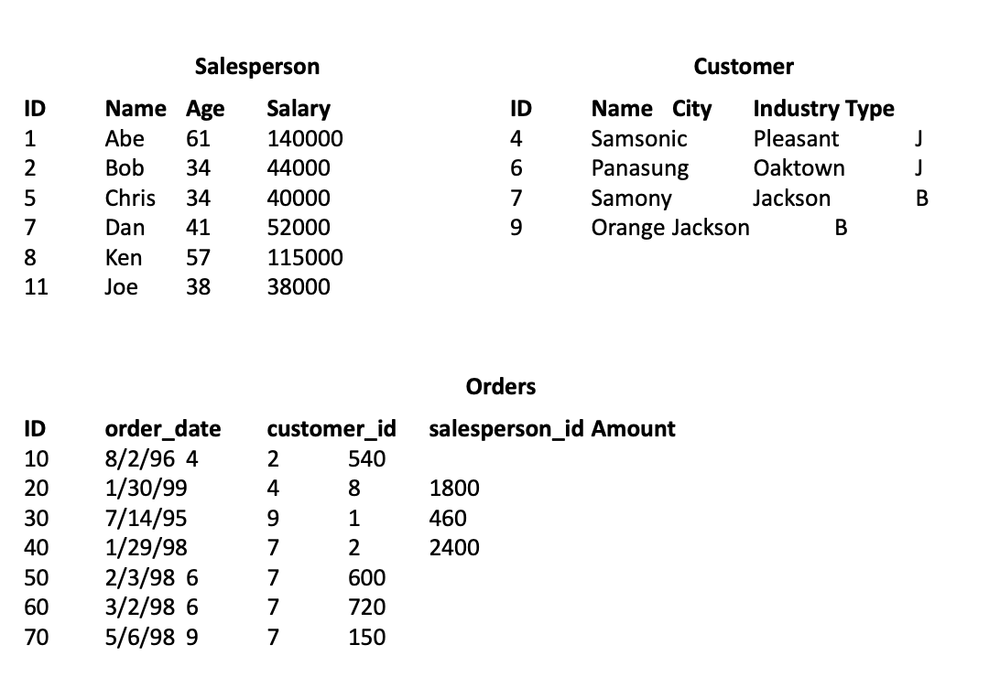

## 💡 Pergunta 6

**Given the tables above, write the SQL query that:
- a. Returns the names of all Salesperson that don’t have any order with Samsonic.
- b. Updates the names of Salesperson that have 2 or more orders. It’s necessary to add an ‘*’ in the end of the name.
- c. Deletes all Ssalesperson that placed orders to the city of Jackson.
- d. The total sales amount for each Salesperson. If the salesperson hasn’t sold anything, show zero.**



#### ✅ Resposta

#### 🔹 a) Vendedores que **não** possuem pedidos com o cliente "Samsonic"

```sql
SELECT s.name
FROM Salesperson s
LEFT JOIN (
    SELECT DISTINCT o.salesperson_id
    FROM Orders o
    JOIN Customer c ON o.customer_id = c.id
    WHERE c.name = 'Samsonic'
) sub ON s.id = sub.salesperson_id
WHERE sub.salesperson_id IS NULL;
```

✅ **Justificativa**:
- Substitui `NOT IN` por `LEFT JOIN ... IS NULL`, mais seguro e performático.
- Evita falhas em caso de valores nulos.

---

#### 🔹 b) Atualiza nomes dos vendedores com **2 ou mais pedidos**

```sql
UPDATE Salesperson
SET name = CONCAT(name, '*')
WHERE id IN (
    SELECT salesperson_id
    FROM Orders
    GROUP BY salesperson_id
    HAVING COUNT(*) >= 2
);
```

✅ **Justificativa**:
- Estrutura padrão e eficiente.
- É recomendado garantir **índice em `Orders.salesperson_id`**.

---

#### 🔹 c) Deleta vendedores que realizaram pedidos para clientes da cidade **"Jackson"**

```sql
DELETE FROM Salesperson s
WHERE EXISTS (
    SELECT 1
    FROM Orders o
    JOIN Customer c ON o.customer_id = c.id
    WHERE o.salesperson_id = s.id
      AND c.city = 'Jackson'
);
```

✅ **Justificativa**:
- `EXISTS` é mais performático que `IN` pois para na primeira ocorrência.
- Ideal para grandes volumes de dados.

---

#### 🔹 d) Total de vendas por vendedor, incluindo aqueles que **não venderam**

```sql
SELECT s.id, s.name, COALESCE(SUM(o.amount), 0) AS total_sales
FROM Salesperson s
LEFT JOIN Orders o ON s.id = o.salesperson_id
GROUP BY s.id, s.name;
```

✅ **Justificativa**:
- `LEFT JOIN` garante que todos os vendedores apareçam, mesmo sem vendas.
- Agrupar por **PK (`s.id`)** melhora o plano de execução.

---

#### ✅ Resumo das boas práticas aplicadas

| Item | Técnica aplicada              | Benefício técnico                                        |
|------|-------------------------------|----------------------------------------------------------|
| a    | `LEFT JOIN ... IS NULL`       | Evita `NOT IN` com `NULL` e melhora performance          |
| b    | `IN` com `GROUP BY` + índice  | Efetivo e rápido com índice                             |
| c    | `EXISTS`                      | Escalabilidade e menor custo de busca                    |
| d    | `GROUP BY id, name`           | Melhor plano de execução e clareza                      |
